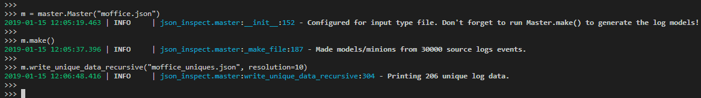

# JSON Inspector

An experimental tool to compare and flatten json-formatted logs for
SIEM ingestion.

## Prerequisites

- Install Python 3.6+

## Installation

Create your virtual environment and install dependencies.

```bash
$ git clone https://github.com/IntegralDefense/json-inspect.git
$ cd thisrepo
$ python3 -m venv venv
$ source venv/bin/activate
(venv) $ pip install -r requirements.txt
```

## What is it good for?

Here's a step through of the logic for expirmenting with this module:

- When ingesting a new JSON-formatted log source, you usually have to
configure transforms or filters in order to make the data searchable
or indexable.
- Indexing and searching through JSON-formatted logs can get hairy quick
if you have several tiers of nested logs or objects within a JSON-formatted
log or event.
- One method of resolving this difficulty and/or increase SIEM effeciency
is to __flatten__ the logs by using transforms or filters.
- In order to flatten logs, you have to know what the log structure
looks like and where it may need to be flattened.
- This becomes increasingly difficult with large volumes of logs.

### Benefits of json-inspect:
1. Understand how you can flatten logs for better SIEM performance/efficiency.
2. Identify unique log formats / structures for transforms and filter
development.


#### 1. Flattening
Json-inspect attempts to aid in this 'flattening' process by comparing
logs based on their __structure__ rather than their data. By using
json-inspect you can more effeciently understand log structure so you
can perform log flattening, like this:

```javascript
// Before flattening:
{
  ctime: "Thu Jan 17 13:43:57 2019",
  device: "777-777-7777",
  eventtype: "authentication",
  factor: "Passkey",
  host: "another2fa-host.local",
  application: "EmailFederation",
  ip: "10.7.0.5",
  location: {
    city: "Mortons Gap",
    country: "US",
    state: "Kentucky"
  },
  reason: "User approved",
  result: "SUCCESS",
  timestamp: 1546254864,
  username: "Another2FAUser"
}

// After flattening
{
  ctime: "Thu Jan 17 13:43:57 2019",
  device: "777-777-7777",
  eventtype: "authentication",
  factor: "Passkey",
  host: "another2fa-host.local",
  application: "EmailFederation",
  ip: "10.7.0.5",
  city: "Mortons Gap",
  country: "US",
  state: "Kentucky",
  reason: "User approved",
  result: "SUCCESS",
  timestamp: 1546254864,
  username: "Another2FAUser"
}
```

An example of flattening this log via a logstash filter would look something
like this:

```ruby
# flatten location
if [location] {
    ruby { code => "event.get('location').each {|k, v| event.set(k, v) }" }
}
```

Another use-case is when you run across dynamic keys within a JSON
object. For example:

```javascript
{
  user: "Alfred",
  hardtokens: {
    hardtoken-yk-55555: {
      platform: "yubikey",
      totp_step: null
      },
    hardtoken-yk-555556: {
      platform: "yubikey",
      totp_step: null
    }
  }
}

// OR another example:

{
  user: "Batman",
  phones: {
    iPhone1: {
      number: "+1555555555",
      os: "Some Apple iOS"
      description: "Stays in the bat cave"
    },
    iPhone2: {
      number: "+15555555556",
      os: "Another Apple iOS",
      description: "Stays in the bat mobile"
    }
  }
}
```

In these cases, you have dynamic keys (iPhonex, hardtoken-yk-xxxxxx, 
etc.). You may have to flatten these logs by adding or converting these
items into a list.

An example of how this could be accomplished with a logstash filter:

```ruby
# create hardtokens list
if [hardtokens] {
  ruby {
    code => "
      event.set('hardtokens_tmp', [])
      event.get('hardtokens').each do |k,v|
        event.set('hardtokens_tmp', event.get('hardtokens_tmp') + [ event.get(k) ])
      end
    "
  }
}

# create phones list
if [phones] {
  ruby {
    code => "
      event.set('phones_tmp', [])
      event.get('phones_tmp').each do |k,v|
        if v != nil
          if v.key?('type')
            event.set('phones_tmp', event.get('phones_tmp') + [ v['type'] + ': ' + v['number'])
          else
            event.set('phones_tmp', event.get('phones_tmp') + [ 'Unknown: ' + v['number'] ])
          end
        end
      end
    "
  }
}
```

#### 2. Identify unique log structures

When you are looking at a log source and trying to understand the strcuture,
it is good to review the vendor documention or product documentation.
However, we all know that one (or those many) vendors who's documentation
is lacking.

Json-inspect attempts to remedy this by giving you the ability to parse a
large volume of logs and then output unique log formats. Here is an example
when parsing a large volume of Office 365 Management API logs:



Notice that we modeled 30k logs and were able to narrow those down to
only 206 logs that you need to be manually reviewed.

Also as part of this example, notice that we wrote the logs to file using
the 'write_unique_data_recursive' function. This writes the actual data
from each log structure that is identified as unique so that you can view
an example of the raw log content as you build your transforms and filters.

## Modeling logs

__Modeling__ logs refers to how json-inspect _thinks_ about each log.

Json-inspect models logs by parsing JSON objects and then converting
them to __minion__ objects. As a minion, Json-inspect stores the data
of the log values as well as a _model_ of the data.

The model is helpful because we can use it to compare log structures
of logs with varying content. We can also output the data by using
the same minion if needed.

The following JSON data types do not change the structure of the log.
The model will label these datatypes as __edge__ so that when we
compare the models, the labels will be equivalent:
- Integer
- String
- Bool
- Null

The following data types do change the structure of the log so their
labels are set as 'DICT' and 'LIST' respectively:
- object/dictionary/hash table
- array/list

_Note: In addition to the data types that do adjust log structure, we also want
to compare dictionaries that may include differing keys._

#### But how do I use these models, labels, minions, etc. to determine which log structures are unique?

If you converted ```[123, "my_string"]``` to a string and then hashed
it, the hash would be different than the hash for ```[456, "AnotherString"]```.

Using the labels from our log models, however, these two lists would be
converted to ```["edge", "edge"]``` and would result in an equivalent
hash for both logs. This is essentially how we compare logs that
contain varying data.

To take it a step further, json-inspect models the above as ```["edges_only"]```
so that the hash stays the same whether you have two edges or forty-five.
It acts this way because having forty-five edges does not change the
_structure_ of the log, only the quantity of items in the list.

Essentially, json-inspect gives each data set a common label. Then, it
provides a way to hash the object, which is basically sorting keys and
then convertin the object to a string. Once in string form, it is hashed.

And as you change the __resolution__ in which you look at the model, the
more specific you can get about how deeply you want to look for unique logs.

For example, take a look at these two logs:

```javascript
{
  "key1": "MyString",
  "key2": 12345,
  "key3": ["ListItem", 54321, {"NestedKey1": "NestedValue"}, true, null, ["InnerList","MoreInnerList"]],
  "key4": {
    "NestedKey2": "SomeValue"
  }
}

// Log 2
{
  "key1": "MyString",
  "key2": 12345,
  "key3": ["ListItem", 54321, "NotNestedValue", false, null, ["InnerList", "MoreInnerList"]],
  "key4": {
    "NestedKey2": "SomeValue"
  }
}
```

If you look at these logs with a resolution of zero, you would get the following:

```python

from json_inspect import master

m = master.Master("reamde.json")  # Set the file to be used
m.make()  # Parse the logs and create the models

m.print_unique_models(resolution=0, indent=2)

# Output:
{
  "7346da258c47dc6dcf2cf6184638c91f": {
    "key1": "edge",
    "key2": "edge",
    "key3": "LIST",
    "key4": "DICT"
  }
}
```

Notice a couple things:
1. You are presented with the hash of the object at this resolution.
2. There is only ONE model printed.

There is only one model printed because at the initial tier of the logs,
they are both equivalent.

Now lets use a resolution of 1:

```python

from json_inspect import master

m = master.Master("reamde.json")  # Set the file to be used
m.make()  # Parse the logs and create the models

m.print_unique_models(resolution=1, indent=2)

# Output:
{
  "1a8a5c002dfec9aa58e65af353c969e4": {
    "key1": "edge",
    "key2": "edge",
    "key3": [
      "DICT(s)",
      "LIST(s)",
      "edge(s)"
    ],
    "key4": "DICT_KEYS: ['NestedKey2']"
  },
  "14d538d29f4ea8d6ba2556a689bcd357": {
    "key1": "edge",
    "key2": "edge",
    "key3": [
      "LIST(s)",
      "edge(s)"
    ],
    "key4": "DICT_KEYS: ['NestedKey2']"
  }
}
```
Now, we see two separate hashes at this resolution. Note that at this resolution,
the structure of the log does differ within the list that is the value for
__key3__.

#### Deeper dive on how json-inspect models log data

To model log data, json-inspect ingests each data value in a log into
an object called a __minion__. A minion contains the following items
(but not limited to):
- Data value it represents
- The label of the data type (edge, DICT, LIST, etc.)
- Child minions, like in the case of a dictionary or list.

An example log:

```javascript
{
  "key1": "value1",
  "key2": {
    "key3": 123
  },
  "key4": ["Hello"]
}
```
To simplify, you can think of this JSON object being stored like this:

```python
DictMinion(
  label="DICT",
  data={
  "key1": EdgeMinion(label="edge", data="value1"),
  "key2": DictMinion(
    label="DICT",
    data={"key3": EdgeMinion(label="edge", data=123)}
  ),
  "key4": ListMinion(
    label="LIST",
    data=[EdgeMinion(label="edge", data="Hello")]
  ),
}
```
 
Each Minion has a set of functions to display the label, data, or hash
of the model.

## Quickstart

To run the program, you create a __master__. The master api give you
access to various functions to ingest logs and output the unique log
structures and models.

- Master.**print_unique_models**(resolution=0, indent=None)
  - Prints the __model__ for the log based on resolution (how deep you want to
  represent the log). You can pretty print by using indent.
- Master.**print_unique_data**(resolution=0, indent=None)
  - Prints the __data__ for the log based on resolution specified.
- Master.**write_unique_models**(output_file, resolution=0, indent=None)
  - Writes the models to file.
- Master.**write_unique_data**(output_file, resolution=0, indent=None)
  - Writes the data to file.
- Master.**write_unique_data_recursive**(output_file, resolution=0, indent=None)
  - Recursively starts at the resolution defined, notes unique log models,
  then subtracts 1 from the resoltuion and repeats until resolution == 0-.
  This gives you a thorough run through high-volume logs.

```python
from json_inspect import master

m = master.Master(input_file="example_logs.json")  # Set file to ingest.
m.make()  # Parse logs and create models.

# These commands will step through the structure of the log model.
# These functions will help to identify where your logs can be
# flattened.
m.print_unique_models(resolution=0, indent=2)

# OUTPUT

{
  "2444e6cb9505d17b89efb154f78a18ea": {
    "age": "edge",
    "assignment": "edge",
    "name": "edge",
    "previous_assignments": "LIST",
    "rank": "edge",
    "species": "edge"
  },
  "672ad685628256d29a5369ebefd059c1": {
    "age": "edge",
    "home_planet": "edge",
    "name": "edge",
    "specialties": "LIST",
    "species": "edge"
  }
}
```

```python
m.print_unique_models(resolution=1, indent=2)

# OUTPUT

{
  "244c3e15aa13c51c0be4626610baf777": {
    "age": "edge",
    "assignment": "edge",
    "name": "edge",
    "previous_assignments": [
      "DICT(s)"
    ],
    "rank": "edge",
    "species": "edge"
  },
  "91143518648e5077589680d948593883": {
    "age": "edge",
    "home_planet": "edge",
    "name": "edge",
    "specialties": [
      "edges_only"
    ],
    "species": "edge"
  },
  "998db1309e33d4ca6b6b4d0f65758857": {
    "age": "edge",
    "home_planet": "edge",
    "name": "edge",
    "specialties": [
      "DICT(s)",
      "edge(s)"
    ],
    "species": "edge"
  }
}
```

```python

m.print_unique_data (resolution=0, indent=2)

# OUTPUT

{
  "2444e6cb9505d17b89efb154f78a18ea": {
    "age": 43,
    "assignment": "USS Titan",
    "name": "William T. Riker",
    "previous_assignments": "LIST",
    "rank": "Captain",
    "species": "human"
  },
  "672ad685628256d29a5369ebefd059c1": {
    "age": 22,
    "home_planet": "Tatooine",
    "name": "Anakin Skywalker",
    "specialties": "LIST",
    "species": "human"
  }
}
```

```python
m.print_unique_models(resolution=4, indent=2)

# OUTPUT

{
  "cd894fcbc758efe21e2207fdb40e5a38": {
    "age": 63,
    "assignment": "USS Enterprise-E",
    "name": "Jean-Luc Picard",
    "previous_assignments": [
      {
        "assignment": "USS Reliant",
        "rank": "Ensign"
      },
      {
        "assignment": "USS Stargazer",
        "rank": "Commanding Officer"
      },
      {
        "assignment": "USS Enterprise-D",
        "rank": "Commanding Officer"
      }
    ],
    "rank": "Captain",
    "species": "human"
  },
  "d63b0a2a9c17362110eff29fb7c8d225": {
    "age": 43,
    "assignment": "USS Titan",
    "name": "William T. Riker",
    "previous_assignments": [
      {
        "assignment": "USS Pegasus",
        "rank": "Ensign"
      },
      {
        "assignment": "USS Potemkin",
        "rank": "Lieutenant"
      },
      {
        "assignment": "USS Hood",
        "rank": "First Officer"
      },
      {
        "assignment": "USS Enterprise-D",
        "rank": "First Officer"
      },
      {
        "assignment": "USS Enterprise-E",
        "rank": "First Officer"
      }
    ],
    "rank": "Captain",
    "species": "human"
  },
  "3cce4c3e9d51bf0f575a12c0955be489": {
    "age": 22,
    "home_planet": "Tatooine",
    "name": "Anakin Skywalker",
    "specialties": [
      "Anger",
      {
        "alientating_companions": [
          "edge(s)"
        ]
      },
      "Pod racing"
    ],
    "species": "human"
  }
}
```
